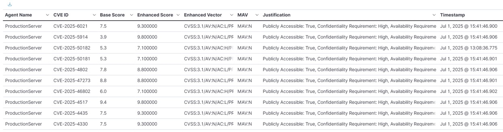
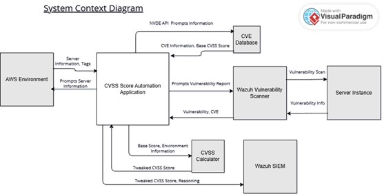
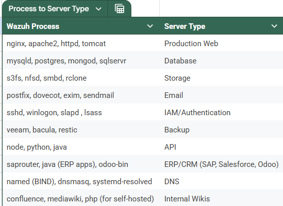

# CVSS Automation With Internal Environment Variables

## Problem Statement
In the evolving field of cybersecurity, security analysts within organizations both large and small face difficulty with vulnerability prioritization. Traditional scanning tools used for identification of threats do not have the proper information to correctly score a vulnerability based on its internal environment. This leads to inaccuracy, and potential security risks.
Our project aims to address this inaccuracy, by using automation to aggregate all relevant information about an environment, and then return a more informed CVSS score to the security analyst. Furthermore, it aims to close the skill gap between junior and senior security analysts by helping them make a more informed decision. This will lessen human error, as well as potential biases or inconsistencies between different analysts.

## Relevance and Impact
Improves vulnerability prioritization; more accurate CVSS scoring ensures that security analysts focus on significant security threats that might have been previously misprioritized due to environmental factors. This improvement reduces manual assessment time by automating the workflows, minimizing the human error in vulnerability evaluation and, provides a holistic view of organizational risks.

## Overview
The tool we've implemented collects the internal environmental values from AWS instances/Wazuh agents which includes values like installed packages, whether it is publicly network facing or not, then makes a determination of what type of servers they are. This script tags AWS EC2 instances based on detected server types (e.g., Web, DNS, Email) and calculates an enhanced CVSS environmental score based on CR/AR/IR values as well as whether or not the servers are publicly network facing for better vulnerability prioritization. This is done with the use of a proprietary 

## Features
- Automated script that identifies installed packages on AWS Linux EC2 instances registered as agents to a Wazuh Server.
- Tags EC2 instances in AWS with CR/IR/AR scores.
- Outputs JSON objects to a log file monitored by Wazuh.
- Through a custom search and visualization, outputs the enhanced scores and all related information to the end user in Wazuh.

## Requirements
- Active AWS account
- IAM user or role with permissions to
  - Create IAM roles/users
  - Manage EC2 instances, including permissions to modify EC2 tags and configuration 
- AWS Ubuntu-Based EC2 Instances (2 or more)
  - Wazuh Server/Manager/Dashboard Instance: Server installed onto the instance
    - Wazuh Vulnerability Detector enabled 
  - Wazuh Agent Instances: Servers with Wazuh Agent installed, enrolled to the Wazuh Server
  - NVD API Key

## Environment Setup
  - AWS Environment Setup
    - IAM Roles
      - Wazuh Server Instance: Add "AmazonEC2FullAccess" permission to the IAM role tied to this server. If an IAM role does not yet exist for this server, create one with this permission. This allows the server instance to change the CR, IR, AR tags for the agent servers.
    - Instance Security Rules (These instructions are assuming these instances share a VPC (Virtual Private Cloud) in AWS)
      - Wazuh Server Instance Inbound Rules:
        - TCP Port 1514: Wazuh agent log forwarding
        - TCP Port 9200: Wazuh dashboard elasticsearch
        - TCP Port 55000: Wazuh API access
        - TCP Port 22: SSH remote access
        - TCP Port 443: HTTPS Wazuh Dashboard UI
      - Wazuh Agent Instances Inbound Rules:
        - TCP Port 22: SSH remote access

  - Wazuh Server Instance Setup
    - To access the command line interface of this server for setup, utilize AWS "Connect" tool, or set up SSH for the server.
    - Install and set up Wazuh Server/Dashboard following the official guide, if it is not already running on the server: https://documentation.wazuh.com/current/installation-guide/index.html
    - Create a venv (virtual environment): python -m venv <environment_name>. Activate it with source <environment_name>/bin/activate. For the purpose of these instructions, we will name it cvss-env
      -  Make sure the following packages are installed: pip, python3, boto3, requests, cvss, sqlite3, curl
    - ossec.conf (Wazuh server configuration file)
      - Add this block into the <ossec_config> section, to monitor a .log file. This .log file can be placed anywhere as needed. For the purpose of these instructions, we will point to "/tmp/"
        -  ```
              <localfile>
              <log_format>json</log_format>
              <location>/tmp/wazuh_test.log</location>
              </localfile>
           ```
    - Wazuh Rule /var/ossec/etc/rules/local_rules.xml
      - Add the following custom rules to the local_rules.xml file used by Wazuh, to alert for .json objects being appended to monitored log files:
      - ```
        <group name="json,test,">
          <rule id="100999" level="5">
            <decoded_as>json</decoded_as>
            <description>Any JSON line from /tmp/wazuh_test.log</description>
          </rule>
        </group>
        
        <group name="sudo,custom,">
          <rule id="110000" level="0">
            <if_sid>5402</if_sid>
            <field name="data.command">/usr/bin/tee -a /tmp/wazuh_test.log</field>
            <description>Ignore sudo tee command to append to test log</description>
          </rule>
        </group>
        ```
    - Add the "ServerTypeTagging.py" and "CVETagRetrieval.py" scripts to a location on the server that you would like to execute from. For the purpose of these instructions, we will point to "~/"
      -  Save the following as a bash script (ex. "run-cvss-tagging.sh")
      - ```
        #!/bin/bash
        #Run script for determining server types of agents
        sudo python3 ServerTypeTagging.py
        
        # Activate virtual environment
        source ~/cvss-env/bin/activate
        
        # Run the Python script
        python3 CVETagRetrieval.py
        
        # Define the target Wazuh log file path
        TARGET_LOG="/tmp/wazuh_test.log"
        
        # If the file doesn't exist, create it and set permissions
        if [ ! -f "$TARGET_LOG" ]; then
            touch "$TARGET_LOG"
            chmod 777 "$TARGET_LOG"
        fi
        
        # Append contents and truncate source log
        cat /home/ubuntu/wazuh_test.log >> "$TARGET_LOG"
        truncate -s 0 /home/ubuntu/wazuh_test.log
        
        #Exit virtual environment
        deactivate
        ```
      - This bash script runs the entire process, and should run whenever the user wants their scores to be enhanced. This can be scheduled to run automatically through the use of a cron job as needed.

    - Script Setup
      - Once you have both scripts set up on the instance, there are a few variables that need to be changed for them to function.
      - CVETagRetrieval.py
        - At line 23, change NVD_API_Key value to your organizations key.
        - At line 26-28, AWS Credentials section must be updated with your own AWS Access Key, Secret Access Key, and Region.
        - At line 237/238, change  username and password variables to valid Wazuh credentials with admin privileges. Admin account can be used here.

  - Wazuh Visualization Setup
    -  In Wazuh Explore>Discover, save a search with the following: "rule.id: 100999", "NOT data.Base Score: -1.0", "NOT data.Enhanced CVSS Score: null"
    -  In Wazuh Explore>Visualize, create a new visualization using the saved search, and add the following metrics/buckets
        - Bucket: Split rows data.Agent Name: Descending
        - Bucket: Split rows data.CVE ID: Descending
        - Metric Top Hit data.Base Score
        - Metric Top Hit data.Enhanced CVSS Score
        - Metric Top Hit data.Enhanced CVSS Vector
        - Metric Top Hit data.MAV
        - Metric Top Hit data.Justification
        - Metric Top Hit @timestamp
    - When the bash script runs, once the alerts are ingested into Wazuh, this visualization should look something like this:
      -  

## FAQ
"The script runs, but I keep getting an exception after the tags are updated."
- Make sure that both the Wazuh Server and Wazuh Agent instances have Wazuh updated to the same version. With a discrepancy in versions, the tool runs into some issues.

"The script runs all the way through, but nothing is appended to the log file!"
- This can happen the first time the tool is run, but it depends on if the file exists or not and where it is placed. As the above instructions define it in /tmp/, it is a temporary file that will be purged when the server is rebooted. If the file does not exist at the time the tool is first run, you will need to run it a second time. This can be fixed by saving it in another directory.

"I'm not getting any alerts in Wazuh dashboard with the specified rule ID."
- Double check that the specified log file is correct in the script, ossec.conf, and the ruleset file. Keep in mind that it is case-specific and must be exactly the same.

"I want to use this tool, but my servers are edge-cases that are not in line with the predefined list of server-types, or the predefined list of installed packages does not apply to me."
- Manually changing CR, IR, and AR tags for your instances is always an option. You can modify the bash script to not run the ServerTypeTagging script, and just the second one, and it will refer to the manually added tags. Otherwise, you can modify the ServerTypeTagging script's server mapping with modified values to meet your needs. This is all proprietary.

"I see the Wazuh alerts, but my Wazuh visualization is not populating!"
- This means that the visualization itself is misconfigured. You can double check the .json objects that show up in the alerts, and check what you have set for the metrics in the visualization to compare if they are the same. For example, data.Justification would pull from the "Justification" object from the alerts, using the attached search that is used for the visualization.
  
"Why are some scores making a drastic increase or decrease from their base score?"
- This can be the case when the CVE ID has multiple CVSS scores given to it. If the base score for example is a 3.0, however this CVE also has a second different score of 6.0, and the server is a Production Web server, we can see a jump from 3.0 to 9.0. This can be of use as it will point out discrepancies in scores where applicable, a security analyst may have overlooked something that needs further inspection.

"Some of my scores are not showing up / I am seeing less updated scores per CVE ID than I have vulnerabilities"
- This is a pertinent question and it has to do with the limitations of this tool. The tool was designed with CVSS version 3.0 in mind, as 4.0 was not widely adopted yet during its development. This may be implemented in the future, but for now, updated scores for CVE IDs with 4.0 CVSS scores in place will return as null and be filtered out in the visualization.

"Why is the tool taking a long time to execute?"
- Good question, as of now the tool can take up to 10 minutes to fully execute, but this will depend on the connection strength/amount of agents/vulnerabilities. Keep in mind looking at the system architecture, we are moving a lot of data to many different locations throughout the process. First we are checking the database for installed packages and making a determination, modifying AWS instance tags. We are pulling the CVE IDs for EACH vulnerability for EACH agent in Wazuh. Next, we are requesting the CVSS base scores from NVD for each of these. Then, we are sending this back to the Wazuh server, appending to a log file, and appending EACH one at a time as an alert in the dashboard. Finally, these are ingested into the Wazuh visualization.

"I want to only run this tool for specific agents / I want to exclude an agent from having its tags modified"
- This can be done by modifying the ServerTypeTagging script's main function and adding an "if not db_file.endswith('.db') or db_file == '000.db':" case, with 000 being the agent ID. 000 is the ID of the Wazuh Server itself, and is by default excluded. Other servers can be added by ID.

### System Context Diagram



### Process To Server Mapping


### Server Requirement Mapping
| System Type         | Spoofing CR | Tampering IR | Repudiation IR | Info Disclosure CR | DoS AR | Privilege Escalation IR | Justification                                                                                       | Final Verdict                      |
|---------------------|-------------|---------------|----------------|---------------------|--------|--------------------------|-------------------------------------------------------------------------------------------------------|------------------------------------|
| Production Web      | MEDIUM      | HIGH          | -           | HIGH                | HIGH   | MEDIUM                   | Session hijacking risks. Code injection, defacement. Leaked customer data. Revenue depends on uptime. Admin console access.         | CR=HIGH, IR=HIGH, AR=HIGH          |
| Database            | -           | HIGH          | MEDIUM         | HIGH                | MEDIUM   | -                   | SQLi, data corruption. PII/financial data stored. Audit logs can be deleted. Failover exists, but outages costly.                                 | CR=HIGH, IR=HIGH, AR=MEDIUM        |
| Storage             | -           | MEDIUM        | -              | HIGH                | MEDIUM   | -                   | Ransomware if writeable. HIGH since PII might be included. Business impact varies.                              | CR=HIGH, IR=MEDIUM, AR=MEDIUM      |
| Email               | MEDIUM      | -             | MEDIUM         | HIGH                | -      | -                        | Phishing/spoofed emails. Leaked emails = compliance risk. Log deletion possible.                                      | CR=HIGH, IR=MEDIUM, AR=LOW         |
| Backup              | HIGH        | -             | -              | HIGH                | -      | HIGH                     | Credential theft. Admin rights compromise. Password hashes exposed.                                                | CR=HIGH, IR=HIGH, AR=MEDIUM          |
| IAM/Authentication  | -           | HIGH          | -              | HIGH                | HIGH   | -                     | Ransomware target. Holds all sensitive data. Last line of defense.                                       | CR=HIGH, IR=HIGH, AR=HIGH          |
| API                 | HIGH        | -             | -              | MEDIUM              | HIGH      | -                     | Injection attacks. Depends on data exposed. Critical for integrations.                                   | CR=MEDIUM, IR=HIGH, AR=HIGH        |
| ERP/CRM             | -           | HIGH          | HIGH           | HIGH                | -      | -                        | Financial fraud risk. Holds PII/PCI data. Audit trails critical.                                          | CR=HIGH, IR=HIGH, AR=MEDIUM        |
| DNS                 | HIGH        | -             | -              | -                   | -      | HIGH                     | Cache poisoning. Breaks all connectivity.                                                             | CR=HIGH, IR=LOW, AR=HIGH           |
| Internal Wikis      | -           | LOW           | -              | MEDIUM              | -      | -                        | Leaked internal docs. Revertible changes.                                                             | CR=MEDIUM, IR=LOW, AR=LOW          |
